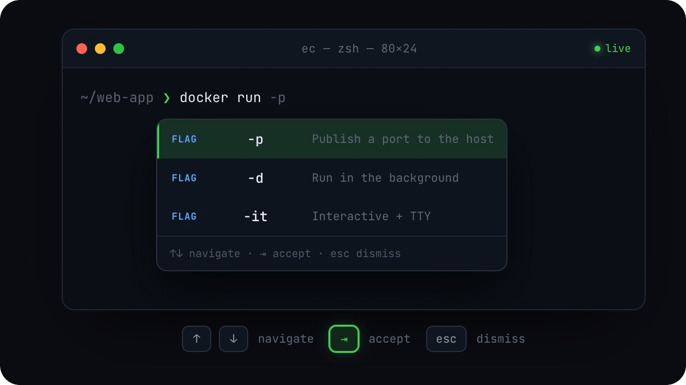

<p align="center">
  
</p>

<h1 align="center">Easy Complete</h1>

<p align="center">
  <b>IDE-style inline autocomplete for your macOS terminal.</b><br/>
  An open-source, Fig-style completion engine for <code>zsh</code>, <code>bash</code> & <code>fish</code>.
</p>

<p align="center">
  <a href="https://github.com/chen86860/easy-complete/releases"></a>
  
  
  <a href="#-license"></a>
  <a href="https://github.com/chen86860/easy-complete/stargazers"></a>
</p>

<p align="center">
  <a href="https://easy-complete.emmmm.dev">Website</a> ·
  <a href="https://github.com/chen86860/easy-complete/releases/latest">Download</a> ·
  <a href="./CHANGELOG.md">Changelog</a> ·
  <a href="./AGENTS.md">Contributing</a>
</p>

<p align="center">
  <b>English</b> · <a href="./README.zh-CN.md">简体中文</a>
</p>

**Easy Complete** is a macOS terminal autocomplete app — IDE-style inline completions
for your shell, rendered in a native overlay window that follows your cursor. It is a
local-first terminal completion engine focused purely on autocomplete —
a lightweight, fully local alternative to Fig.

You get fish-shell-style suggestions for hundreds of CLIs (`git`, `npm`, `docker`,
`cargo`, …): flags, subcommands, file paths, and arguments, completed as you type.
Autocomplete runs fully on-device — no account, no cloud calls, no AI requests, and
your commands never leave your Mac. The app collects anonymous usage statistics
(app opens, daily completion counts — never command content), which you can disable
any time with `ec telemetry disable`. See the [Privacy page](https://easy-complete.emmmm.dev/privacy-policy)
for the full list of what is and isn't collected.

<p align="center">
  
</p>

## Contents

- [Features](#-features)
- [Requirements](#-requirements)
- [Install](#-install)
- [Usage](#-usage)
- [Uninstall](#-uninstall)
- [How it works](#-how-it-works)
- [Development](#-development)
- [Contributing](#-contributing)
- [License](#-license)

---

## ✨ Features

- **IDE-style inline completions** — subcommands, flags, arguments and file paths for
  hundreds of CLIs, rendered in a native overlay that follows your terminal cursor.
- **Fully offline** — completion specs are bundled into the `.app` at build time and
  loaded from disk. There is no network fallback, no account, and no AI request.
- **Works with the terminals you already use** — iTerm2, Apple Terminal, VS Code,
  Cursor, JetBrains IDEs via the PTY integration; Ghostty, Kitty, WezTerm, Zed,
  Alacritty and Otty via the bundled input method.
- **`zsh`, `bash` and `fish`** — shell integration is installed and managed for you.

---

## 💻 Requirements

| Requirement      | Detail                                                                      |
| ---------------- | --------------------------------------------------------------------------- |
| Operating system | macOS 12.0 (Monterey) or later                                              |
| Architecture     | Apple Silicon (arm64) — the published DMG is arm64 only                     |
| Shells           | `zsh`, `bash`, `fish`                                                       |
| Permission       | **Accessibility** (required — see [below](#grant-accessibility-permission)) |

---

## ⚡ Install

### Homebrew (recommended)

```bash
brew install --cask chen86860/tap/easy-complete
```

Then launch **Easy Complete** from `/Applications` and follow the setup panel — it
checks Accessibility permission, shell integration and the input method, and repairs
anything missing in one click.

### Download the DMG manually

[Download latest DMG](https://github.com/chen86860/easy-complete/releases/latest/download/Easy-Complete-arm64.dmg) ·
[All releases](https://github.com/chen86860/easy-complete/releases)

Open the DMG, drag **Easy Complete.app** into `/Applications`, launch it, and follow the
same setup panel as above.

### Build from source

For development, or if you need to build locally, clone the repository and run the
installer:

```bash
git clone https://github.com/chen86860/easy-complete.git
cd easy-complete
./scripts/install.sh
```

The source installer will:

1. Build the Rust binaries and the TypeScript frontend.
2. Assemble `Easy Complete.app` and copy it to `/Applications`.
3. Symlink the `ec` and `ecterm` CLIs into `~/.local/bin`.
4. Let you enable **Launch at Login** from Settings (a system Login Item on macOS 13+, with a LaunchAgent fallback on macOS 12).
5. Set up shell integration and register the input method.
6. **Prompt you to grant Accessibility permission** (required — see below).

When it finishes, reload your shell:

```bash
exec $SHELL
```

### Grant Accessibility permission

Easy Complete positions the completion popup relative to your focused terminal
window, which requires the macOS **Accessibility** permission. The installer triggers
the system prompt automatically; approve **Easy Complete** in:

> System Settings → Privacy & Security → Accessibility

If completions never appear, this is almost always the cause. Run `ec doctor` to check,
and re-trigger the system prompt with:

```bash
ec debug prompt-accessibility
```

---

## 🚀 Usage

Once installed and granted permission, just start typing in any supported terminal —
suggestions appear inline as you type.

| Key             | Action                            |
| --------------- | --------------------------------- |
| `↑` / `↓`       | Move through suggestions          |
| `⇥` (Tab) / `→` | Accept the highlighted suggestion |
| `Esc`           | Dismiss the popup                 |

The settings & onboarding dashboard is available from the **Easy Complete menu bar
icon** (system tray).

Useful CLI commands:

```bash
ec doctor                       # diagnose common problems
ec diagnostic                   # print environment / integration status
ec integrations install input-method   # (re)register the macOS input method
ec settings list                # view settings
ec settings <key> <value>       # change a setting
```

### Supported terminals

Most terminals work out of the box via the PTY integration — including iTerm2, Apple
Terminal, VS Code, Cursor, ChatGPT (Codex), and JetBrains IDE terminals. Terminals that
bypass the standard PTY path (**Ghostty, Kitty, WezTerm, Zed, Alacritty, Otty**)
additionally rely on the bundled input method for cursor tracking — this is registered
automatically during install.

---

## 🗑 Uninstall

First remove the integrations and application data — this works no matter how you
installed the app:

```bash
ec uninstall
```

This removes the shell integration, terminal integrations, input method registration,
LaunchAgent and application data. It surgically removes only Easy Complete's own input
source from the system preferences (your other keyboard layouts and input methods are
left untouched). It does **not** delete the app bundle, so finish with the step matching
your install method:

| Installed via | Then run                                                                   |
| ------------- | -------------------------------------------------------------------------- |
| Homebrew      | `brew uninstall --cask chen86860/tap/easy-complete`                        |
| DMG           | Move `/Applications/Easy Complete.app` to the Trash                        |
| Source        | `./scripts/uninstall.sh` from the repo (does everything above in one pass) |

Finally, reload your shell with `exec $SHELL`.

---

## 🧩 How it works

Easy Complete runs as three cooperating native processes that talk over Unix domain
sockets (Protobuf messages):

| Binary          | Crate         | Role                                                                                                                             |
| --------------- | ------------- | -------------------------------------------------------------------------------------------------------------------------------- |
| `easy-complete` | `fig_desktop` | Native app host — owns the autocomplete overlay and dashboard (React apps in `wry` WebViews), system tray, and window management |
| `ecterm`        | `figterm`     | Pseudoterminal between your shell and terminal emulator; intercepts the shell edit buffer to drive completions                   |
| `ec`            | `ec_cli`      | CLI entry point — `setup`, `integrations`, `diagnostic`, `settings`, and more                                                    |

Shell hooks (`.zshrc`, `.bashrc`, fish config) report shell state — CWD, command text,
cursor position — back to `ecterm` on every prompt and keystroke. On macOS, the
`fig_input_method` helper app reports caret position for terminals that bypass the PTY.

**Identifiers**

- App bundle ID: `dev.emmmm.easy-complete`
- Input method bundle ID: `dev.emmmm.easy-complete.inputmethod`
- App bundle: `/Applications/Easy Complete.app`

---

## 🛠 Development

> [AGENTS.md](./AGENTS.md) is the full architecture and contributor guide — crate map,
> IPC layout, WebView lifecycle, bundled specs and release process. The commands below
> are just enough to get a local build running.

### Toolchain

- Rust `1.87.0` (pinned in `rust-toolchain.toml`), edition 2024
- Node `>=22.13 <23`, pnpm `11.14` (pinned by `packageManager` in `package.json`)
- Turborepo for the TypeScript build graph

### Rust

```bash
# Build all release binaries
cargo build --release -p fig_desktop -p figterm -p ec_cli -p fig_input_method

# Run a single crate in dev mode
cargo run --bin ec -- <subcommand>
cargo run --bin easy-complete

cargo clippy --locked --workspace --color always -- -D warnings   # lint (CI: -D warnings)
cargo fmt                                                         # format
cargo test -p <crate_name>                                        # test a crate
```

### TypeScript

```bash
pnpm turbo build --filter="./packages/*"   # build all packages
pnpm dev:autocomplete                       # watch the autocomplete UI (port 3124)
pnpm lint                                   # lint
pnpm test                                   # run Vitest
```

In dev, Vite serves the WebView UIs on localhost and `fig_desktop` connects to those
instead of the bundled `Contents/Resources/`.

### Project layout

| Path        | Contents                                                                   |
| ----------- | -------------------------------------------------------------------------- |
| `crates/`   | Rust workspace — desktop app, PTY, CLI, input method, IPC, integrations    |
| `packages/` | TypeScript workspace — overlay UI, dashboard UI, spec parser, IPC bindings |
| `proto/`    | Protobuf definitions shared by the Rust and TypeScript sides               |
| `scripts/`  | Install, uninstall, app bundling, DMG, release and spec-sync scripts       |
| `website/`  | Product website                                                            |

See [AGENTS.md](./AGENTS.md) for the per-crate and per-package breakdown.

---

## 🤝 Contributing

Issues and pull requests are welcome.

- **Report a bug** — `ec issue` opens a pre-filled report with your diagnostics
  attached, or use the [issue templates](https://github.com/chen86860/easy-complete/issues/new/choose)
  directly. Please include `ec doctor` output.
- **Before opening a PR** — read [AGENTS.md](./AGENTS.md), and make sure
  `cargo clippy --locked --workspace -- -D warnings`, `cargo fmt`, `pnpm lint` and
  `pnpm test` all pass.
- **Commits** follow [Conventional Commits](https://www.conventionalcommits.org/)
  (`feat:`, `fix:`, `refactor:`, `chore:`).
- **Security issues** — please follow [SECURITY.md](./SECURITY.md) instead of filing a
  public issue.

---

## 📜 License

Licensed under the MIT License. Easy Complete is based on the upstream Amazon Q
Developer CLI; its original copyright notice is retained in [LICENSE](./LICENSE).
Third-party copyright and license terms are collected in
[THIRD_PARTY_NOTICES.txt](./THIRD_PARTY_NOTICES.txt).
