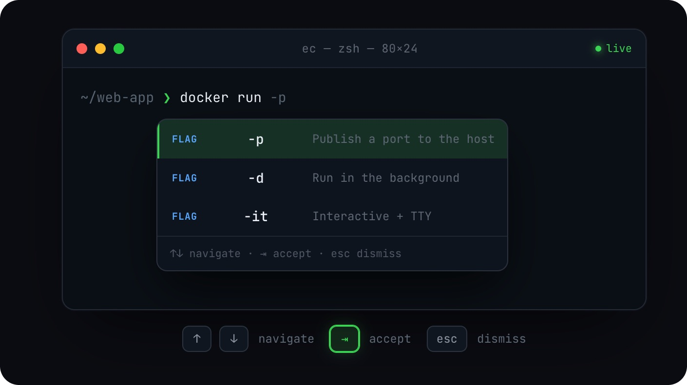

<p align="center">
  
</p>

<h1 align="center">Easy Complete</h1>

<p align="center">
  <b>为 macOS 终端打造的 IDE 风格行内自动补全。</b><br/>
  一款开源、纯本地、Fig 风格的命令行补全引擎，支持 <code>zsh</code>、<code>bash</code> 与 <code>fish</code>。
</p>

<p align="center">
  <a href="https://github.com/chen86860/easy-complete/releases"></a>
  
  
  
  <a href="https://github.com/chen86860/easy-complete/stargazers"></a>
</p>

<p align="center">
  <a href="./README.md">English</a> · <b>简体中文</b>
</p>

**Easy Complete** 是一款 macOS 终端自动补全应用——以原生浮层窗口跟随光标，为你的 shell
提供 IDE 风格的行内补全。它基于 Amazon Q Developer CLI 精简而来，只专注于终端自动补全这
一件事——是一款轻量、完全本地、开源的 Fig 替代品。

你会在输入 `git`、`npm`、`docker`、`cargo` 等数百种命令行工具时，获得类似 fish shell 的
建议：参数、子命令、文件路径、选项，边打边补。

<p align="center">
  
</p>

> **平台：** 仅支持 macOS（Apple Silicon / ARM64）。

---

## ⚡️ 安装

### 下载 DMG

打开 GitHub Releases 页面，下载最新的 Apple Silicon DMG：

[前往 Releases 页面](https://github.com/chen86860/easy-complete/releases)

然后：

1. 打开 `Easy-Complete-arm64.dmg`。
2. 把 **Easy Complete.app** 拖到 `/Applications`。
3. 这个构建未签名，macOS 可能会加上 quarantine 标记。首次安装后执行一次：

   ```bash
   xattr -dr com.apple.quarantine "/Applications/Easy Complete.app"
   ```

4. 从 `/Applications` 启动 **Easy Complete**。
5. 按提示授予**辅助功能**权限。
6. 重新加载你的 shell：

   ```bash
   exec $SHELL
   ```

首次启动时，Easy Complete 会设置随附的 CLI 二进制、shell 集成、输入法和登录启动项。

### 从源码构建

如果你要做开发，或需要在本机自行构建，可以克隆仓库并运行安装脚本：

```bash
git clone https://github.com/chen86860/easy-complete.git
cd easy-complete
./install.sh
```

源码安装脚本会：

1. 构建 Rust 二进制和 TypeScript 前端。
2. 组装出 `Easy Complete.app` 并复制到 `/Applications`。
3. 把 `ec` 和 `ecterm` 两个 CLI 软链到 `~/.local/bin`。
4. 安装 LaunchAgent，使应用登录时自启。
5. 配置 shell 集成并注册输入法。
6. **弹出授予「辅助功能」权限的提示**（必需，见下文）。

完成后，重新加载你的 shell：

```bash
exec $SHELL
```

### 授予「辅助功能」权限

Easy Complete 需要把补全浮层定位到你当前聚焦的终端窗口，这依赖 macOS 的**辅助功能
（Accessibility）**权限。安装脚本会自动触发系统授权弹窗，请在以下位置勾选 **Easy Complete**：

> 系统设置 → 隐私与安全性 → 辅助功能

**如果补全始终不出现，几乎都是这个权限没授予。** 可用下面的命令重新触发授权弹窗：

```bash
ec debug prompt-accessibility
```

---

## 🚀 使用

安装并授权后，在任意受支持的终端里直接开始输入即可——建议会随输入实时出现在行内。

| 按键            | 操作           |
| --------------- | -------------- |
| `↑` / `↓`       | 在建议间移动   |
| `⇥` (Tab) / `→` | 采用高亮的建议 |
| `Esc`           | 关闭补全浮层   |

设置与引导面板（dashboard）可从**菜单栏的 Easy Complete 图标**打开。

常用 CLI 命令：

```bash
ec doctor                       # 诊断常见问题
ec diagnostic                   # 打印环境 / 集成状态
ec integrations install input-method   # （重新）注册 macOS 输入法
ec settings list                # 查看设置
ec settings <key> <value>       # 修改某项设置
```

### 受支持的终端

大多数终端通过 PTY 集成开箱即用。少数绕过标准 PTY 路径的终端（**Ghostty、Kitty、
WezTerm、Zed、Alacritty**）还需要依赖随附的输入法来追踪光标位置——这一项会在安装时自动
注册。

---

## 🗑️ 卸载

```bash
./scripts/uninstall.sh
```

该脚本会移除应用包、CLI 软链、LaunchAgent、输入法、shell 集成以及全部应用数据。它只会
精确移除 Easy Complete 自己的输入源，**不会动**你其它的键盘布局和输入法。

---

## 🧩 工作原理

Easy Complete 由三个相互协作的原生进程组成，通过 Unix 域套接字（Protobuf 消息）通信：

| 二进制          | Crate         | 职责                                                                                           |
| --------------- | ------------- | ---------------------------------------------------------------------------------------------- |
| `easy-complete` | `fig_desktop` | 原生应用宿主——承载补全浮层与设置面板（运行于 `wry` WebView 的 React 应用）、系统托盘、窗口管理 |
| `ecterm`        | `figterm`     | 介于 shell 与终端模拟器之间的伪终端；拦截 shell 编辑缓冲区以驱动补全                           |
| `ec`            | `q_cli`       | CLI 入口——`setup`、`integrations`、`diagnostic`、`settings` 等                                 |

Shell 钩子（`.zshrc`、`.bashrc`、fish 配置）在每次提示符和按键时，把 shell 状态（当前目
录、命令文本、光标位置）回报给 `ecterm`。在 macOS 上，`fig_input_method` 辅助应用负责为绕
过 PTY 的终端上报光标位置。

**标识符**

- 应用 bundle ID：`dev.emmmm.easy-complete`
- 输入法 bundle ID：`dev.emmmm.easy-complete.inputmethod`
- 应用包路径：`/Applications/Easy Complete.app`

---

## 🛠️ 开发

### 工具链

- Rust `1.87.0`（在 `rust-toolchain.toml` 中固定），edition 2024
- Node `^22`，pnpm `10`
- TypeScript 构建图由 Turborepo 管理

### Rust

```bash
# 构建所有 release 二进制
cargo build --release -p fig_desktop -p figterm -p q_cli -p fig_input_method

# 以 dev 模式运行单个 crate
cargo run --bin q_cli -- <子命令>
cargo run --bin easy-complete

cargo clippy --locked --workspace --color always -- -D warnings   # lint（CI 要求 -D warnings）
cargo +nightly fmt                                                # 格式化（需 nightly）
cargo test -p <crate_name>                                        # 测试某个 crate
```

### TypeScript

```bash
pnpm turbo build --filter="./packages/*"   # 构建所有包
pnpm dev:autocomplete                       # 监听补全 UI（端口 3124）
pnpm lint                                   # lint
pnpm test                                   # 运行 Vitest
```

开发模式下，Vite 在 localhost 提供 WebView UI，`fig_desktop` 会连接到它，而不是包内
`Contents/Resources/` 下的产物。

### 核心 crate

| Crate                   | 职责                                                    |
| ----------------------- | ------------------------------------------------------- |
| `fig_desktop`           | 原生应用宿主：窗口（`tao`）、WebView（`wry`）、系统托盘 |
| `figterm`               | PTY 拦截、shell 编辑缓冲区追踪                          |
| `q_cli`                 | CLI 二进制，所有 `ec` 子命令                            |
| `fig_input_method`      | macOS 输入法辅助应用（光标追踪）                        |
| `fig_integrations`      | shell / 终端 / 编辑器集成的安装逻辑                     |
| `fig_ipc` / `fig_proto` | Unix 套接字 IPC 原语与生成的 Protobuf 类型              |

### 核心 TypeScript 包

| 包                    | 职责                        |
| --------------------- | --------------------------- |
| `autocomplete-app`    | 补全浮层 React UI           |
| `dashboard-app`       | 设置 / 引导 React UI        |
| `autocomplete-parser` | CLI spec 解析、建议生成     |
| `shell-parser`        | shell 命令行分词器          |
| `api-bindings`        | 生成的 TS Protobuf IPC 绑定 |

---

## 📜 许可证

继承上游 Amazon Q Developer CLI，采用 MIT 与 Apache 2.0 双许可证。
